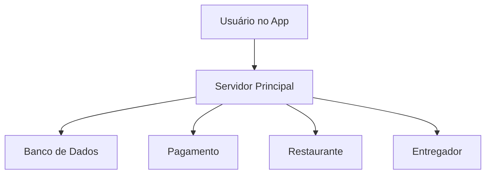
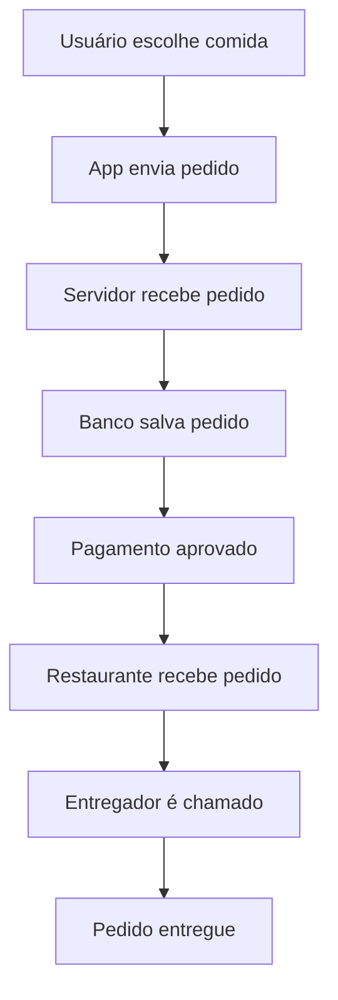
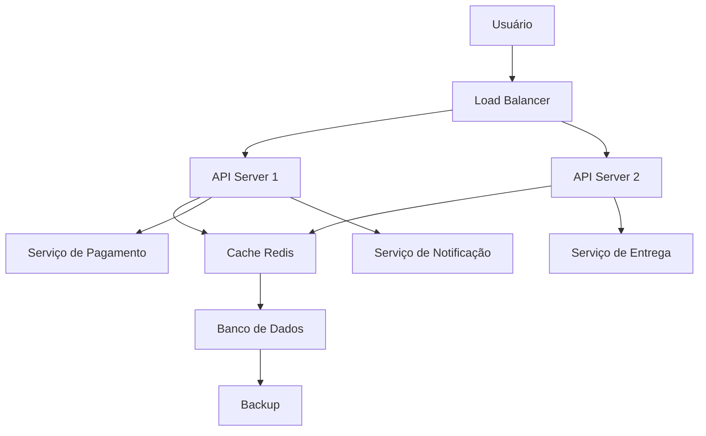

# Projeto Back-end — iFood

---

# 1 — DIAGRAMA INICIAL (SIMPLIFICADO)

---

# PROBLEMAS ENCONTRADOS

- Tudo está em um único servidor
- Banco de dados sem backup
- Sem cache para acelerar o sistema
- Pagamento sobrecarrega o servidor principal
- Falta de escalabilidade

---

# 2 — FLUXO: FAZER PEDIDO

---

# 3 — REVISÃO (O QUE IA CORRIGIRIA)

A IA melhoraria a arquitetura separando serviços em partes menores, adicionando cache para performance, criando balanceamento de carga e colocando backups automáticos no banco de dados. Também recomendaria separar pagamento, entrega e notificações em serviços independentes.

---

# 4 — DIAGRAMA CORRIGIDO (ARQUITETURA REAL)

---

# 5 — O QUE EU APRENDI

Eu descobri que aplicativos como o iFood não funcionam com apenas um servidor. Eles usam vários sistemas trabalhando juntos, como APIs, bancos de dados, cache e serviços separados para pagamento e entrega. Isso garante que o sistema funcione mesmo com muitos usuários ao mesmo tempo.

---

# 6 — O QUE QUEBRARIA COM 100x USUÁRIOS

Se o aplicativo tivesse 100 vezes mais usuários, o primeiro problema seria o banco de dados e o servidor principal, pois muitos pedidos seriam feitos ao mesmo tempo. Isso causaria lentidão e possivelmente queda do sistema.

---

# 7 — O QUE EU MUDARIA

Eu adicionaria mais servidores para distribuir a carga, usaria cache para acelerar o sistema e separaria os serviços em microserviços. Também implementaria monitoramento e backups automáticos para evitar falhas e perda de dados.